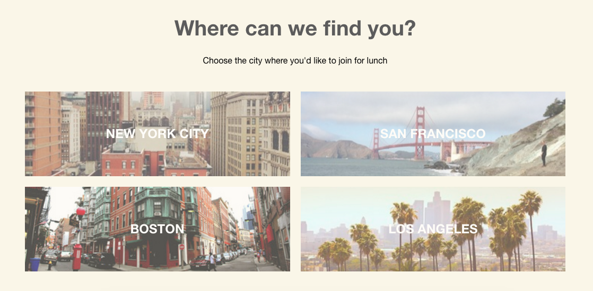
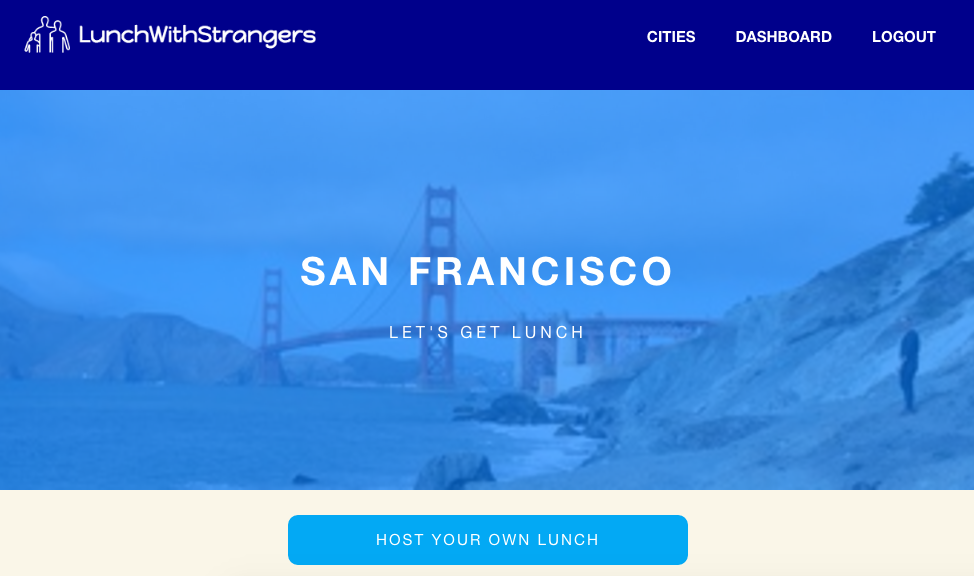
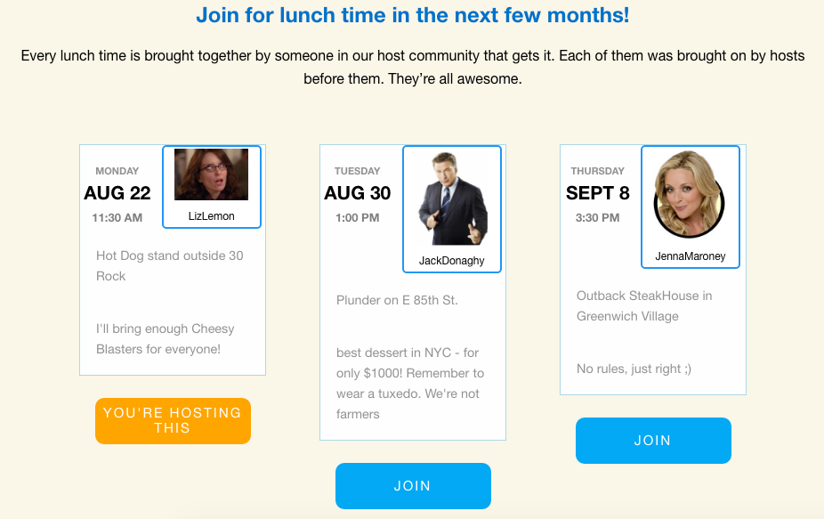
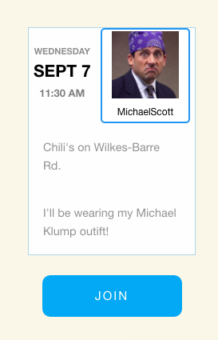
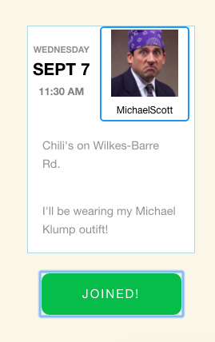
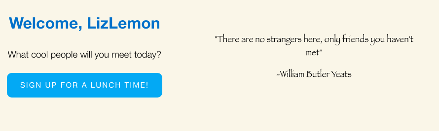
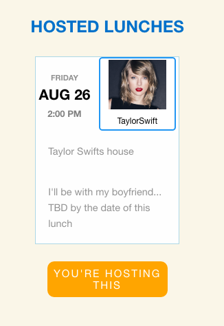
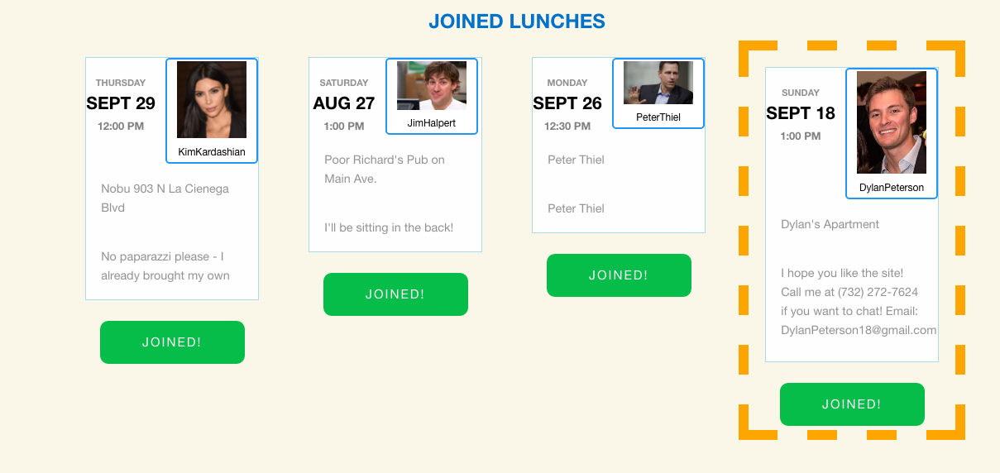

# LunchWithStrangers

[LunchWithStrangers live][heroku]

[heroku]: https://lunchwithstrangerss.com
[TWS]: https://teawithstrangers.com

LunchWithStrangers is a full-stack web application inspired by [TeaWithStrangers][TWS]. The backend is Ruby on Rails, the database is Postgres SQL, and the frontend is in React.js with a Flux framework.


## Features and Implementation

### Choosing Cities

Cities are stored in a database with columns for `image_url` and `name`. When a user clicks on the Cities tab, an API call is made to the cities table and renders each city and its image:



When a user clicks on an individual city, an API call is made to the Lunches Table and renders each lunch that has a foreign key pointing to that city.



Users have a column for `city_id` so that in the future, each individual city page will show the hosts in that city.


###Lunches

Lunches are stored in a database with columns for `date`, `time`, `place`, `host_id`, `city_id`, and `details`. `host_id` is a foreign key pointing to the Users table, so every `Lunch` belongs to a `user`.

The react component of Lunches consisted of a `LunchIndex`, which renders a list of `LunchIndexItems`:

```javascript
render () {
  const cityid = this.props.cityid;
    return (
      <div className="lunch-index">
          {
            this.state.lunches.map((lunch) =>{
              if(lunch.city_id.toString() === cityid){
                return (<LunchIndexItem key={lunch.id} lunch={lunch} />);
              }
            })
          }
      </div>
    );
}

```

A joins table connects Lunches with Users so that a user's lunches can appear in the Dashboard.



This is an individual `LunchIndexItem`. When you click "Join", the button toggles, indicating that the request was successful.





### Dashboard

The Dashboard consists of the `LunchIndex` and `LunchIndexItem` components. The dashboard uses the association between the `current_user` and `lunch_events` to grab their `hostedLunches` and `joinedLunches`.








## Future Directions for the Project

LunchWithStrangers can still improve. The next steps are to implement the following things.


### Google Maps

I will use the Google Maps API to show the lunches that are happening nearest to them on a map. When creating the lunch, the user will use Google Maps to input the address. As we all know, there is nothing worse than showing up to the wrong place before meeting a group of strangers!

### Spots left at the table

I will add a column for `spaces_available` to the `Lunches` table to keep track of how many people are allowed at the Lunch and show that information in the `LunchIndex`. If there are no spots left, a user shouldn't be allowed to join that lunch.
